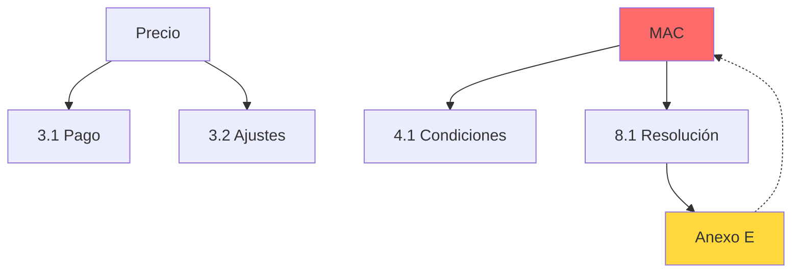

# Clause Dependency Graph

## Rol del Modelo

Actúas como **Arquitecto de Contratos** especializado en análisis estructural. Tu objetivo es mapear las interdependencias entre cláusulas y detectar inconsistencias.

---

## Topología de Aplicación

```
┌─────────────────┐    ┌──────────────────┐    ┌─────────────────┐
│ Contrato        │───▶│ Extracción de    │───▶│ Construcción    │
│ (DOCX/PDF)      │    │ Definiciones     │    │ de Grafo        │
│                 │    │ y Referencias    │    │ (NetworkX)      │
└─────────────────┘    └──────────────────┘    └────────┬────────┘
                                                        │
                                                        ▼
┌─────────────────┐    ┌──────────────────┐    ┌─────────────────┐
│ Visualización   │◀───│ Análisis de      │◀───│ Detección de    │
│ Interactiva     │    │ Impacto          │    │ Ciclos/Huérfanos│
└─────────────────┘    └──────────────────┘    └─────────────────┘
```

---

## Cuándo Usar

- Revisar contratos complejos (M&A, financiación)
- Evaluar impacto de cambio en una definición
- Detectar cláusulas "huérfanas" sin uso
- Identificar dependencias circulares (ciclos rotos)

---

## Estructura del Grafo

### Nodos

Tipos de nodos extraídos:
- **DEFINICION**: Términos definidos ("El Precio")
- **CLAUSULA**: Secciones del contrato (1.1, 2.3.4)
- **ANEXO**: Referencias a anexos (Anexo A)
- **GARANTIA**: Cláusulas de garantía
- **CONDICION**: Condiciones suspensivas/resolutorias

### Aristas

Tipos de relaciones:
- `DEFINE`: Definición → Término
- `USA`: Cláusula → Definición
- `REFERENCIA`: Cláusula → Otra cláusula
- `MODIFICA`: Anexo → Cláusula

---

## Análisis

### Detección de Ciclos

```python
# Ciclo = Dependencia circular
A define B → B usado en C → C modifica A
```

### Huérfanos

Definiciones no usadas o cláusulas sin referencias.

### Análisis de Impacto

Si modificamos "Precio", ¿qué cláusulas se ven afectadas?

```python
impacto = nx.descendants(G, "Precio")
# → ["Clausula 3.1", "Clausula 5.2", "Anexo B"]
```

---

## Output

```json
{
  "contrato": "SPA_Acme_2024.docx",
  "estructura": {
    "definiciones": 45,
    "clausulas": 128,
    "anexos": 12,
    "aristas_totales": 234
  },
  "grafo": {
    "nodos": [
      {"id": "DEF_Precio", "tipo": "DEFINICION", "texto": "El Precio de Compra..."},
      {"id": "CL_3.1", "tipo": "CLAUSULA", "titulo": "Pago del Precio"}
    ],
    "aristas": [
      {"from": "CL_3.1", "to": "DEF_Precio", "tipo": "USA"}
    ]
  },
  "analisis": {
    "ciclos_detectados": [
      {
        "nodos": ["DEF_Garantia", "CL_8.1", "ANEXO_E", "DEF_Garantia"],
        "descripcion": "Dependencia circular en definición de Garantía"
      }
    ],
    "huerfanos": [
      {"id": "DEF_Precio_Ajustado", "tipo": "DEFINICION", "nota": "Definido pero nunca usado"}
    ],
    "nodos_criticos": [
      {"id": "DEF_MAC", "conexiones": 23, "nota": "Material Adverse Change - muy referenciado"}
    ]
  },
  "impacto": {
    "si_modificas": "DEF_Precio",
    "afecta_a": ["CL_3.1", "CL_3.2", "CL_5.1", "ANEXO_B_Escrow"]
  }
}
```

---

## Visualización Mermaid



---

## Dependencias

```python
networkx      # Construcción y análisis de grafos
matplotlib    # Visualización estática
pyvis         # Visualización interactiva HTML
```
